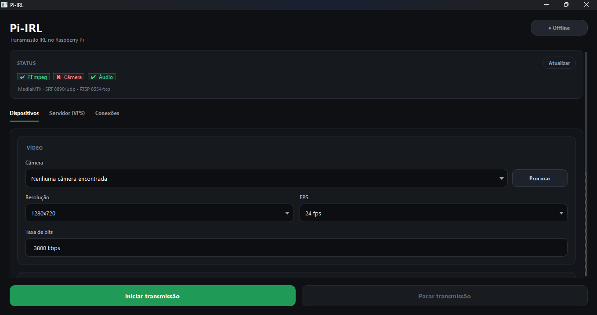
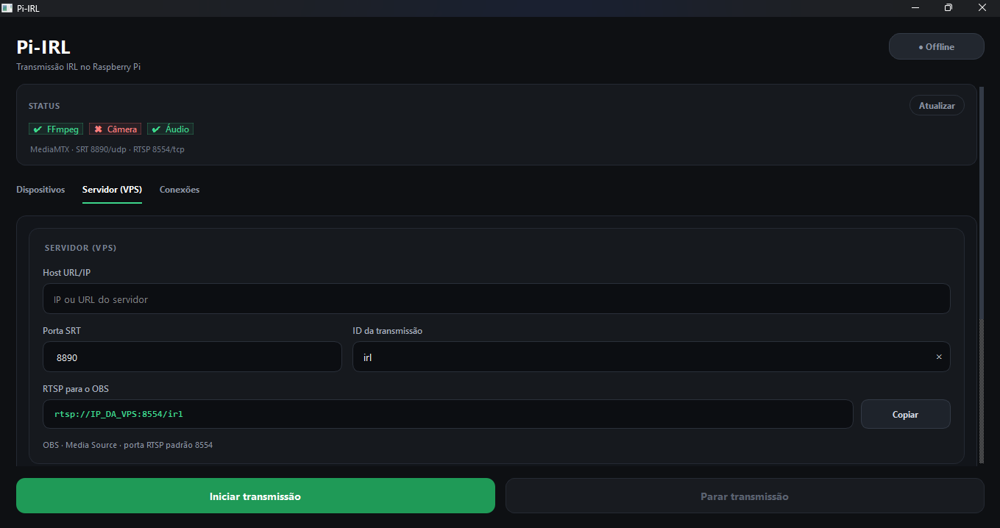
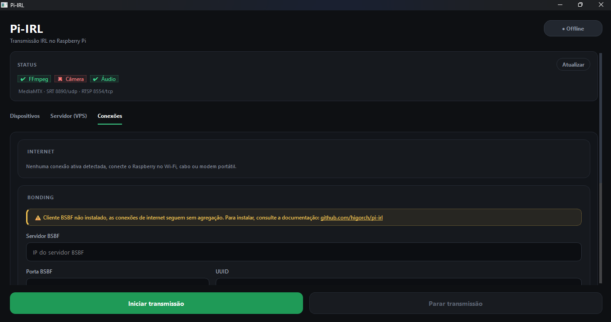

# Pi-IRL

[](https://github.com/higorch/pi-irl) [](LICENSE) [](https://www.python.org/) [](https://www.raspberrypi.com/)

Transmissão IRL no Raspberry Pi: câmera + microfone → **FFmpeg** → **SRT** → **MediaMTX** (VPS) → **RTSP** / OBS.

```text
Câmera + Microfone
        ↓
   Pi-IRL / FFmpeg
        ↓
   SRT  (+ BSBF opcional)
        ↓
   VPS / MediaMTX
        ↓
      RTSP → OBS
```

| Onde | O que roda |
|------|------------|
| **VPS** | MediaMTX · BSBF Server (opcional) |
| **Raspberry Pi** | Pi-IRL · FFmpeg · BSBF Client (opcional) |

## Interface

**Dispositivos** — câmera, resolução, FPS, taxa de bits e microfone.



**Servidor (VPS)** — host do MediaMTX, porta SRT, ID da transmissão e URL RTSP para o OBS.



**Conexões** — conexões de internet ativas e configuração do Bonding (BSBF).



---

## 1. VPS — MediaMTX

Recebe o SRT do Pi e entrega RTSP para o OBS.  
Docs: [Introduction](https://mediamtx.org/docs/kickoff/introduction) · [Install](https://mediamtx.org/docs/kickoff/install)

### Remover instalação anterior (se já existir)

```bash
systemctl stop mediamtx 2>/dev/null || true
systemctl disable mediamtx 2>/dev/null || true
rm -f /etc/systemd/system/mediamtx.service
systemctl daemon-reload
rm -f /usr/local/bin/mediamtx
rm -rf /etc/mediamtx
rm -f /root/mediamtx_v*_linux_*.tar.gz
```

### Instalar (Linux amd64, como root)

```bash
cd /root
wget https://github.com/bluenviron/mediamtx/releases/download/v1.21.0/mediamtx_v1.21.0_linux_amd64.tar.gz
tar -xzf mediamtx_v1.21.0_linux_amd64.tar.gz
mv mediamtx /usr/local/bin/mediamtx
chmod +x /usr/local/bin/mediamtx
mediamtx --version
```

### Configurar

```bash
mkdir -p /etc/mediamtx
cd /etc/mediamtx
wget https://raw.githubusercontent.com/bluenviron/mediamtx/v1.21.0/mediamtx.yml

sed -i \
  -e 's/^rtsp: .*/rtsp: true/' \
  -e 's/^srt: .*/srt: true/' \
  -e 's/^rtmp: .*/rtmp: false/' \
  -e 's/^hls: .*/hls: false/' \
  -e 's/^webrtc: .*/webrtc: false/' \
  -e 's/^moq: .*/moq: false/' \
  /etc/mediamtx/mediamtx.yml
```

### Serviço systemd

```bash
cat > /etc/systemd/system/mediamtx.service <<'EOF'
[Unit]
Description=MediaMTX
After=network.target

[Service]
Type=simple
ExecStart=/usr/local/bin/mediamtx /etc/mediamtx/mediamtx.yml
Restart=always
RestartSec=3

[Install]
WantedBy=multi-user.target
EOF

systemctl daemon-reload
systemctl enable --now mediamtx
systemctl status mediamtx --no-pager
```

### Firewall — só as portas usadas

Com o OBS em `rtsp_transport=tcp`, abra **apenas**:

| Porta | Protocolo | Uso |
|------:|-----------|-----|
| `8890` | UDP | SRT (Pi → VPS) |
| `8554` | TCP | RTSP (OBS) |

```bash
ufw allow 8890/udp comment 'MediaMTX SRT'
ufw allow 8554/tcp comment 'MediaMTX RTSP'
ufw reload
ufw status numbered
```

Não libere RTMP, HLS, WebRTC nem outras portas do MediaMTX.

### URLs

| Papel | URL |
|-------|-----|
| Pi publica | `srt://IP_VPS:8890?mode=caller&streamid=publish:irl` |
| OBS lê | `rtsp://IP_VPS:8554/irl` |

Logs: `journalctl -u mediamtx -f`

---

## 2. VPS — BSBF Server (opcional)

Bonding MPTCP ([BondingShouldBeFree](https://github.com/bondingshouldbefree)). Só precisa se for agregar Wi‑Fi + 4G no Pi.

### Remover instalação anterior (se já existir)

No **servidor** (VPS):

```bash
curl -fsSL https://github.com/bondingshouldbefree/bsbf-resources/raw/main/resources-server/bsbf-server-installer.sh \
  | sudo sh -s -- --uninstall
```

No **cliente** (Raspberry Pi), se o BSBF já estiver instalado:

```bash
sudo bsbf-bonding --uninstall
```

### Instalar servidor

```bash
curl -fsSL srv.bondingshouldbefree.org | sudo sh
```

### Criar cliente

```bash
sudo bsbf-add-client 0
```

Anote a **porta** e o **UUID** retornados. Exemplo:

```text
16384
61e76964-ebdb-410b-a231-2dd6e2687a71
```

### Firewall — só a porta do cliente BSBF

Abra **somente** a porta TCP retornada pelo `bsbf-add-client`. Nada além disso para o bonding.

```bash
# Exemplo: se a porta for 16384
sudo ufw allow 16384/tcp comment 'BSBF bonding'
sudo ufw reload
sudo ufw status numbered
```

Troque `16384` pela porta real do seu cliente. Não abra faixas inteiras “por precaução”.

### Resumo: portas abertas na VPS

| Serviço | Portas | Observação |
|---------|--------|------------|
| MediaMTX | `8890/udp`, `8554/tcp` | Sempre (SRT + RTSP/TCP) |
| BSBF | `PORTA_BSBF/tcp` | Só se usar bonding |

Nada mais de MediaMTX/BSBF precisa ficar aberto (sem `8000`/`8001`, RTMP, HLS, WebRTC, etc.).

---

## 3. Raspberry Pi — instalação completa

### Opção A — script único (recomendado)

```bash
git clone https://github.com/higorch/pi-irl.git
cd pi-irl
chmod +x install.sh start-pi-irl.sh
./install.sh
nano .env   # o install.sh cria a partir do .env.example
```

Opções do `install.sh` (rode como usuário normal, sem `sudo`):

| Opção | O que faz |
|-------|-----------|
| *(nenhuma)* | FFmpeg, V4L2, ALSA, Python/.venv, atalho, **início automático** ao ligar o Pi, **ajuste da câmera** e **reboot** no final |
| `--with-bsbf --server IP --port PORTA --uuid UUID` | Instala o cliente BSBF já na instalação (opcional: o app instala sozinho ao transmitir) |
| `--no-autostart` | Remove/não cria o início automático |
| `--no-camera-fix` | Não aplica o ajuste da câmera |
| `--no-reboot` | Não reinicia sozinho (avisa para rodar `sudo reboot`) |

No `.env`, preencha pelo menos:

```env
VPS_HOST=IP_OU_DOMINIO_DA_VPS
SRT_PORT=8890
STREAM_ID=irl
```

Com bonding, basta preencher no `.env` (ou no card Bonding do app) — o cliente BSBF é instalado/ativado no primeiro **Iniciar transmissão**:

```env
BONDING_SERVER=IP_VPS
BONDING_PORT=PORTA_BSBF
BONDING_UUID=UUID_DO_CLIENTE
```

Iniciar:

```bash
./start-pi-irl.sh
```

### Opção B — manual

```bash
sudo apt-get update
sudo apt-get install -y ffmpeg v4l-utils alsa-utils python3 python3-venv python3-pip git curl

git clone https://github.com/higorch/pi-irl.git
cd pi-irl
python3 -m venv .venv
source .venv/bin/activate
pip install -r requirements.txt
cp .env.example .env
# edite o .env
python -m app.main
```

Cliente BSBF manual (opcional — o app faz isso sozinho ao transmitir):

```bash
curl -fsSL cld.bondingshouldbefree.org | sudo sh -s -- \
  --server-ipv4 IP_VPS \
  --server-port PORTA_BSBF \
  --uuid UUID_DO_CLIENTE
```

### Câmera USB (UVC) — ajuste automático

O `./install.sh` já faz sozinho:

1. Grava `/etc/modprobe.d/uvcvideo.conf` com `options uvcvideo quirks=0x180 nodrop=1 timeout=5000`
2. Acrescenta `usbcore.autosuspend=-1` no final da linha única de `/boot/firmware/cmdline.txt` (backup em `cmdline.txt.bak-pi-irl`)
3. Roda `sudo update-initramfs -u`
4. Ao terminar a instalação, **reinicia o Pi** (10 s para cancelar com Ctrl+C) — `uvcvideo`, `usbcore.autosuspend` e initramfs só valem após o reboot

Os arquivos só são alterados se ainda não estiverem configurados (sem duplicar o `cmdline.txt`).

Equivalente manual (referência):

```bash
# 1. Configura o UVC da câmera
sudo nano /etc/modprobe.d/uvcvideo.conf
# Conteúdo:
# options uvcvideo quirks=0x180 nodrop=1 timeout=5000

# 2. Desativa USB autosuspend no boot
sudo nano /boot/firmware/cmdline.txt
# Adicionar no FINAL da única linha (não crie linha nova):
# usbcore.autosuspend=-1

# 3. Atualiza e reinicia
sudo update-initramfs -u
sudo reboot
```

Conferir após o reboot:

```bash
cat /sys/module/uvcvideo/parameters/quirks      # 384 (= 0x180)
cat /sys/module/usbcore/parameters/autosuspend  # -1
```

### Sudo (senha do Pi)

O `install.sh` e o app (ao instalar/ativar o BSBF) usam `sudo`. No Raspberry Pi OS o usuário padrão já tem sudo sem senha. Se o seu pedir senha, escolha **uma** opção:

**A) Senha no `.env`** — `PI_SUDO_PASSWORD=sua_senha`. Use aspas se tiver espaços nas pontas.
- `install.sh`: valida a senha no início (errada → para) e mantém o sudo autenticado até o fim. Na 1ª instalação, rode `cp .env.example .env` e preencha antes.
- App: roda `sudo -A`, com um helper de askpass (`~/.cache/pi-irl/sudo-askpass.sh`) que não guarda a senha. Ela não aparece em `ps`, não vai para o log e não é herdada pelo FFmpeg.
- O `.env` fica em texto puro com permissão `600` (feita pelo `install.sh`) e já está no `.gitignore`.

**B) Sudo sem senha** (dispensa a variável):

```bash
echo "$USER ALL=(ALL) NOPASSWD: ALL" | sudo tee /etc/sudoers.d/010-pi-irl
sudo chmod 440 /etc/sudoers.d/010-pi-irl
```

---

## 4. Uso do app

Abas:

| Aba | Conteúdo |
|-----|----------|
| **Dispositivos** | Câmera e microfone conectados |
| **Servidor (VPS)** | Host MediaMTX, porta SRT, Stream ID, URL RTSP do OBS |
| **Conexões** | Card Internet (conexões ativas) + card Bonding (BSBF e avisos) |

1. Em **Servidor (VPS)**, confira Host / porta / ID (ou venha do `.env`).  
2. Em **Dispositivos**, escolha câmera e mic. Câmeras: só **USB**. Microfones: **USB** ou entrada **P2** (marcados `· USB` / `· P2`; virtuais e HDMI ficam de fora). No Raspberry o conector P2 da placa é só saída — para mic P2 use um adaptador de som USB com entrada P2 (aparece como USB) ou um HAT de áudio com entrada (aparece como P2). Conectou/removeu → a lista atualiza sozinha e o log registra.  
3. Em **Conexões**, veja as redes ativas; preencha o Bonding (BSBF) só se for usar.  
4. Clique **Iniciar transmissão**.  
5. No OBS: Media Source → `rtsp://IP_VPS:8554/irl`  
   - Formato de entrada: vazio  
   - Opções FFmpeg: `rtsp_transport=tcp`  
   - Buffer de rede: `0` MB  

### Bonding ao clicar em Iniciar transmissão

Com servidor (IPv4), porta e UUID preenchidos, **antes** de iniciar o FFmpeg o app:

| Situação no Pi | O que o app faz |
|----------------|-----------------|
| Cliente BSBF não instalado | Instala: `curl -fsSL cld.bondingshouldbefree.org \| sudo sh -s -- --server-ipv4 … --server-port … --uuid …` (alguns minutos) |
| Instalado com outro servidor/porta/UUID | Grava `/usr/local/etc/bsbf/bsbf-bonding.conf` e roda `bsbf-bonding --enable` |
| Instalado e parado | `bsbf-bonding --enable` |
| Instalado e ativo | Nada — transmite direto |

Depois disso o SRT sai normalmente: com o BSBF ativo, TCP e UDP para a internet passam pelo túnel agregado, sem mudar a URL.

Se algo falhar (sem internet, sudo com senha, erro na instalação), o motivo aparece no registro e a transmissão **segue sem agregação**. Sem bonding configurado, transmite normalmente.

Status do cliente no Pi: `sudo bsbf-bonding --status` · monitor web em `http://localhost:8080/`.

### Início automático ao ligar o Pi

O `install.sh` cria `~/.config/autostart/pi-irl.desktop` (abre o app com `--autostart` quando a área de trabalho carrega). Ao abrir, o app:

1. Confere a configuração salva (Host, ID, câmera e microfone). Incompleta → só abre, sem transmitir.
2. Tenta conectar a câmera e o microfone USB salvos (e esperar a internet) a cada `DEVICE_RETRY_INTERVAL` segundos, até `DEVICE_RETRY_ATTEMPTS` tentativas (padrão: 10 tentativas de 10 em 10 s; `0` = sem limite).
3. Inicia a transmissão (com bonding, se configurado). Se o FFmpeg falhar ao abrir câmera/mic nos primeiros 15 s, conta como tentativa e tenta de novo.
4. Ao vivo por 15 s sem erro → "transmissão estável" no registro e para de tentar. Clicar em **Parar** também interrompe as tentativas.

Requisitos: login automático na área de trabalho (padrão do Raspberry Pi OS) e ter transmitido ao menos uma vez pelo app (salva câmera/mic).  
Desativar: `./install.sh --no-autostart` ou `rm ~/.config/autostart/pi-irl.desktop`.

---

## 5. Arquivo `.env`

```bash
cp .env.example .env
```

| Variável | Descrição |
|----------|-----------|
| `VPS_HOST` | IP ou domínio da VPS (MediaMTX) |
| `SRT_PORT` | Porta SRT (padrão `8890`) |
| `STREAM_ID` | Path do stream (padrão `irl`) |
| `BONDING_SERVER` | IPv4 do servidor BSBF (opcional) |
| `BONDING_PORT` | Porta do cliente BSBF (opcional) |
| `BONDING_UUID` | UUID do cliente BSBF (opcional) |
| `DEVICE_RETRY_ATTEMPTS` | Tentativas de conectar câmera/mic USB no boot (padrão `10`, `0` = sem limite) |
| `DEVICE_RETRY_INTERVAL` | Segundos entre tentativas (padrão `10`, mínimo `2`) |
| `PI_SUDO_PASSWORD` | Senha do sudo do Pi para `install.sh` e bonding (vazio = sudo sem senha). Veja **Sudo (senha do Pi)** |

O `.env` completa/sobrescreve o `config.json` ao abrir o app. Não versione o `.env` (já está no `.gitignore`).

---

## 6. Windows (só UI / desenvolvimento)

```powershell
# FFmpeg no PATH: https://ffmpeg.org/download.html
git clone https://github.com/higorch/pi-irl.git
cd pi-irl
python -m venv .venv
.\.venv\Scripts\Activate.ps1
pip install -r requirements.txt
copy .env.example .env
python -m app.main
```

Bonding e a lista de redes são para Linux/Pi.

---

## Problemas comuns

| Sintoma | O que checar |
|---------|----------------|
| FFmpeg não encontrado | `ffmpeg -version` · rode `./install.sh` |
| Código 251 / falha ao iniciar | Câmera/mic, Host SRT, firewall `8890/udp` |
| OBS preto | Pi **Ao vivo**? `rtsp_transport=tcp`? Firewall `8554/tcp` |
| Bonding não sobe | Mensagem no registro · `sudo bsbf-bonding --status` · `systemctl status bsbf-mptcp xray-bsbf-bonding` · porta liberada na VPS |
| "sudo pediu senha" / "senha do sudo incorreta" | Defina/corrija `PI_SUDO_PASSWORD` no `.env` — ver **Sudo (senha do Pi)** |
| Câmera trava/cai | Conferir `quirks`/`autosuspend` (seção Câmera USB) · rodar `./install.sh` de novo |
| Não transmite ao ligar | Registro do app mostra o que falta · `ls ~/.config/autostart/` · login automático ativo |
| MediaMTX offline | `systemctl status mediamtx` · `journalctl -u mediamtx -f` |
